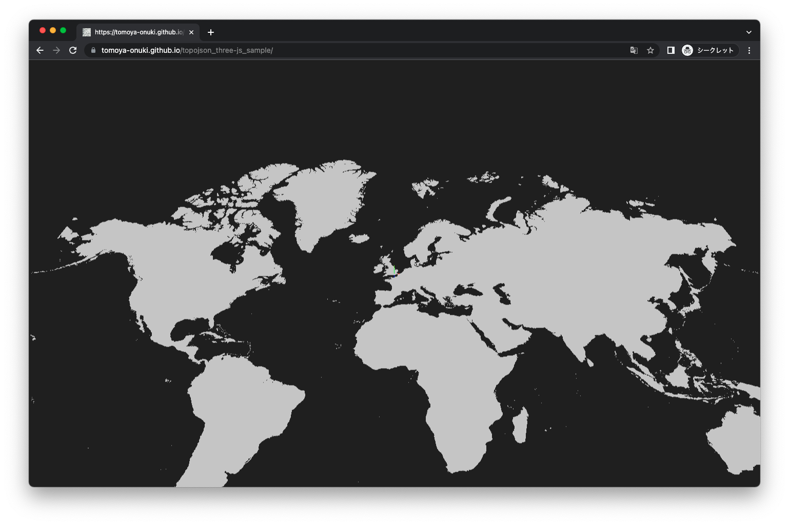

2022.10.11  
小貫智弥  

# TypeScriptとThree.jsでTopoJsonデータを可視化するサンプル

## デモ
https://tomoya-onuki.github.io/topojson_three-js_sample/


<br><br>

## 開発環境
- macOS Monterey 12.0
- vscode v1.72.0
- npm v8.15.0
- typescript v4.1.3
- jQuery v3.5.14
- three.js v0.144.0

### typescriptのセットアップ

1. package.jsonの作成
```
npm init -y
```
scriptの部分に以下を追加  
```
"build": "webpack",
"watch": "webpack -w"
```

2. モジュールのインストール
```
npm i -D webpack webpack-cli typescript ts-loader
```

3. ディレクトリを作る
```
mkdir dist
mkdir src
```

4. tsconfig.jsonを作る
```
npx tsc --init
```

5. webpack.config.jsを用意する（コピーする）
```
touch webpack.config.js
```
ファイルの中身
```js
module.exports = {
    mode: "development",
    entry: "./src/main.ts",
    output: {
      path: `${__dirname}/dist`,
      filename: "main.js"
    },
    module: {
      rules: [
        {
          test: /\.ts$/,
          use: "ts-loader"
        }
      ]
    },
    resolve: {
      extensions: [".ts", ".js"]
    }
  };
```

### Three.jsのセットアップ
```
npm i -S three @types/three
```

### jQueryのセットアップ
```
npm i --save-dev @types/jquery
```

### vsCodeのLiveServerのセットアップ
https://blanche-toile.com/tools/vscode-live-server を参考に設定してください。

<br><br>

## データ
[Natural Earth](https://www.naturalearthdata.com/)で公開されているデータを使用しました。

今回は地図の面が必要になるので、Large Scale Data > Physical > Land をダウンロードします。  
https://www.naturalearthdata.com/downloads/10m-physical-vectors/

### データの加工
ダウンロードしたファイル内に含まれるシェープファイル(.shp)をTopojson形式に変換します。

1. GeoJsonに変換
   ```
   shp2json ne_10m_land.shp > ne_10m_land.geojson
   ```
2. TopoJsonに変換
   ```
   geo2topo -q 1e4 map=ne_10m_land.geojson > ne_10m_land.topojson
   ```

<br><br>

## コーディング
### HTMLファイルの作成
```html
<!DOCTYPE html>
<html>
  <head>
    <meta charset="UTF-8" />
    <script defer src="main.js"></script>
    <link rel="stylesheet" href="style.css">
  </head>

  <body>
      <div id="view"></div>
  </body>
</html>
```

### jQueryのインポート
```js
import $ = require('jquery');
declare var require: any;
```

### Three.jsのインポート
- mergeBufferGeometries : topoJsonから作成した地図のジオメトリを1つにまとめることで処理速度を改善する。
- OrbitControls : マウス(トラックパッド)でスケールや視点を操作する。
```js
import * as THREE from "three";
import { mergeBufferGeometries } from "three/examples/jsm/utils/BufferGeometryUtils";
import { OrbitControls } from "three/examples/jsm/controls/OrbitControls";
```

### レンダラとカメラの作成
```js
let renderer: THREE.WebGLRenderer;
let scene: THREE.Scene;
let camera: THREE.PerspectiveCamera;
let controls: OrbitControls;

let cvsWidth: number = Number($('#view').width());
let cvsHeight: number = Number($('#view').height());

renderer = new THREE.WebGLRenderer({ alpha: true });
scene = new THREE.Scene();
camera = new THREE.PerspectiveCamera(50, cvsWidth / cvsHeight, 1, 5000);

// レンダラーを作成
$("#view").append(renderer.domElement)
camera.position.set(0, 300, 300);   // cameraの設定
```

### ウィンドウサイズの設定
```js
renderer.setPixelRatio(window.devicePixelRatio);
renderer.setSize(cvsWidth, cvsHeihg);
camera.aspect = cvsWidth / cvsHeihg;
camera.updateProjectionMatrix();
```

### orbit controlsの設定
```js
controls = new OrbitControls(camera, renderer.domElement);
controls.enableDamping = true;
controls.dampingFactor = 0.2;
controls.maxPolarAngle = Math.PI / 2;  // 垂直方向の回転の制限
controls.minPolarAngle = -Math.PI / 2;  // 垂直方向の回転の制限
controls.maxDistance = 500;// ズームの制限
controls.minDistance = 10; 
```

### アニメーション処理
```js
startRender()

function startRender(): void {
    setInterval(() => {
        controls.update()
        renderer.render(scene, camera)
    }, 1000 / 24);
}
```

### topojsonの読み込み
```js
let map: TopoJsonMap = new TopoJsonMap();
let url: string = './world_land_10m.topojson';
fetch(url)
    .then(response => response.text())
    .then(jsonString => {
        map.read(jsonString)
        map.draw(scene)
    })
    .catch(err => console.log(err))
```

### topojsonの読み込み (TopoJsonMapクラス)
```js
public read(jsonString: string): void {
const topoJsonData = JSON.parse(jsonString);

// topojsonのデータを緯度経度の絶対座標に変換する
this.topoGeometryList = topoJsonData.objects.map.geometries;
this.topoArcList = this.decodeArcs(topoJsonData, topoJsonData.arcs);
}
```

### topojsonのデコード (TopoJsonMapクラス)
```js
private topoArcList: Vertex[][] = [];
private topoGeometryList: any[] = [];
private decodeArc(topology: any, arc: number[][]): Vertex[] {
    let x = 0, y = 0;
    return arc.map((position) => {
        x += position[0];
        y += position[1];
        if (topology.transform != undefined) {
            const lon = x * topology.transform.scale[0] + topology.transform.translate[0];
            const lat = y * topology.transform.scale[1] + topology.transform.translate[1];
            return new Vertex(lon, lat);
        } else {
            const lon = x
            const lat = y
            return new Vertex(lon, lat);
        }

    });
}

private decodeArcs(topology: any, arcs: number[][][]): Vertex[][] {
    return arcs.map((arc) => this.decodeArc(topology, arc));
}
```

### 描画 (TopoJsonMapクラス)
```js
public draw(scene: THREE.Scene): void {
    // メルカトル図法
    const lon2x = (lon: number): number => {
        let centerLon: number = 0;
        let x: number = lon * (Math.PI / 180);
        let cx: number = centerLon * (Math.PI / 180);
        return (x - cx) * 100;
    }

    const lat2z = (lat: number): number => {
        let centerLat: number = 51.28;
        let y: number = Math.log(Math.tan(Math.PI / 4 + lat * (Math.PI / 180) / 2));
        let cy: number = Math.log(Math.tan(Math.PI / 4 + centerLat * (Math.PI / 180) / 2));
        return (y - cy) * 100;
    }


    let mapMesh = THREE.Mesh = new THREE.Mesh()
    if (this.topoGeometryList.length > 0) {

        // 地図
        let geometryList: THREE.BufferGeometry[] = [];

        // 地域ごとにThree.Geometryを統合してSceneに追加する
        const material: THREE.MeshBasicMaterial = new THREE.MeshBasicMaterial({
            color: 0xcccccc,
            transparent: true,
            opacity: 1.0
        });

        // topoJsonで区切られた地域ごとにThree.Geometryを作る
        this.topoGeometryList.forEach((geo) => {
            if (geo.type === 'Polygon') {
                const arcs: number[][] = geo.arcs;
                arcs.forEach((arcIdxList) => {
                    const geometry: THREE.ExtrudeGeometry = this.threeGeometry(
                        lon2x, 
                        lat2z, 
                        arcIdxList,
                        this.topoArcList
                    );
                    geometryList.push(geometry);
                });
            }
            else if (geo.type === 'MultiPolygon') {
                const arcs: number[][][] = geo.arcs;
                arcs.forEach(arc => {
                    let geometryList0: THREE.BufferGeometry[] = [];
                    arc.forEach((arcIdxList) => {
                        const geometry0: THREE.ExtrudeGeometry = this.threeGeometry(
                            lon2x,
                            lat2z, 
                            arcIdxList, 
                            this.topoArcList
                        );
                        geometryList0.push(geometry0);
                    })
                    const geometry: THREE.BufferGeometry = mergeBufferGeometries(geometryList0);
                    geometryList.push(geometry);
                })

            }
            else if (geo.type === 'LineString') {
                const arcIdxList: number[] = geo.arcs;
                const geometry: THREE.BufferGeometry = this.threeGeometry(
                    lon2x,
                    lat2z, 
                    arcIdxList, 
                    this.topoArcList
                );
                mapMesh = new THREE.Mesh(geometry, material);
                mapMesh.rotateX(-Math.PI / 2); // xz平面が地平面なので回転させる
                scene.add(mapMesh);
            }
        });

        if (geometryList.length > 0) {
            const geometry: THREE.BufferGeometry = mergeBufferGeometries(geometryList);
            mapMesh = new THREE.Mesh(geometry, material);
            mapMesh.rotateX(-Math.PI / 2); // xz平面が地平面なので回転させる
            scene.add(mapMesh);
        }
    }
}
```

### ジオメトリの作成 (TopoJsonMapクラス)
```js
private threeGeometry(lon2x: Function, lat2z: Function, arcIdxList: number[], arcList: Vertex[][]): THREE.ExtrudeGeometry {
    const shape: THREE.Shape = new THREE.Shape();
    let firstPoint: boolean = true;

    arcIdxList.forEach((arcIndex) => {

        if (arcIndex >= 0) {
            const arc = arcList[arcIndex];
            for (let i = 0; i < arc.length; i++) {
                const x: number = lon2x(arc[i].lon, this.centerLon)
                const y: number = lat2z(arc[i].lat, this.centerLat)
                if (firstPoint) {
                    shape.moveTo(x, y);
                    firstPoint = false;
                } else {
                    shape.lineTo(x, y);
                }
            }
        } else {
            const arc = arcList[~arcIndex];
            for (let i = arc.length - 1; i >= 0; i--) {
                const x: number = lon2x(arc[i].lon, this.centerLon)
                const y: number = lat2z(arc[i].lat, this.centerLat)
                if (firstPoint) {
                    shape.moveTo(x, y);
                    firstPoint = false;
                } else {
                    shape.lineTo(x, y);
                }
            }
        }
    });
    const geometry: THREE.ExtrudeGeometry = new THREE.ExtrudeGeometry(shape, {
        steps: 2,
        depth: 0.5,
        bevelEnabled: false
    });
    return geometry;
}
```